# 一、介绍
此TensorBoard插件可将执行序文件解析生成算子图、展示算子图、并比较算子图间差异。方便用户找到执行序间差异，进而帮助用户快速定位执行序相关的精度问题。

# 二、安装及使用

## 2.1 安装方式

### 2.1.1 pip安装（推荐）
下载本插件根目录下 whl 包，使用指令安装（此处{version}为 whl 包实际版本）
```
pip install fast_tb_kgi-{version}-py3-none-any.whl
```

### 2.1.2 源码安装
1. 从仓库下载源码并切换到POC分支:
    ```
    git clone https://gitcode.com/Ascend/msprobe.git -b POC
    ```

2. 进入目录 `plugins/fast_tb_kgi/` 下

3. 编译前端代码
    ```
    cd frontend
    npm install
    npm run build
    ```

4. 回到插件根目录安装
    ```
    cd ../
    pip install .
    ```

## 2.2 使用

### 2.2.1 启动tensorboard
1. 启动 TensorBoard

   ```
   tensorboard --logdir ./
   ```

   注意：确保默认端口 6006 可连通。

   如果需要切换端口号需要在尾部加上指定的端口号，如`--port=6007`

   ```
   tensorboard --logdir ./ --port=6007
   ```

2. 在浏览器上打开 tensorboard

   在浏览器中打开 URL： `http://localhost:6006`。

3. 注意只支持单用户使用，不支持多用户同时使用，多用户同时使用数据及操作会相互覆盖。

4. 建议在本地启动 tensorboard，如果网络浏览器与启动 TensorBoard 的机器不在同一台机器上，需要远程启动，可参照[远程启动方式](#413-远程查看数据)，但需用户自行评估**安全风险**。

### 2.2.2 浏览器查看
推荐使用谷歌浏览器，在浏览器中输入机器地址+端口号回车，出现 TensorBoard 页面，其中/#kgi 会自动拼接。

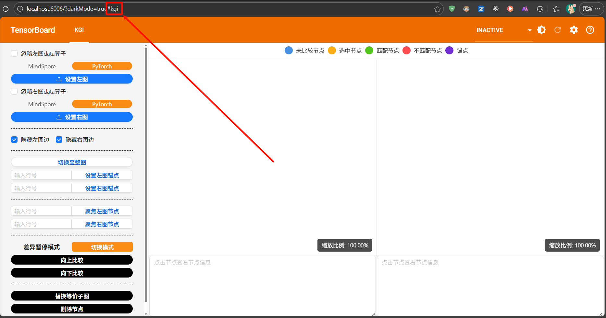

如果您切换了 TensorBoard 的其他功能，此时想回到kgi页面，可以点击左上方的**KGI**

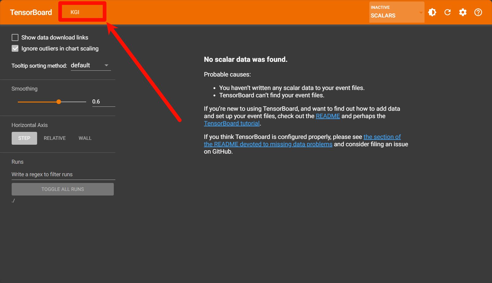

### 2.2.3 设置图

#### 2.2.3.1 导出执行序

##### 2.2.3.1.1 导出MindSpore执行序
```python
os.environ["MS_ALLOC_CONF"] = "memory_tracker:True" 
```
设置如上环境变量，运行模型，执行序文件生成在当前目录下，文件名以`tracker_graph`为前缀，文件扩展名为`.ir`。

##### 2.2.3.1.2 导出PyTorch执行序
```bash
export TORCH_NPU_LOGS="op_plugin"
```
设置如上环境变量，运行模型，执行序文件打印在终端上，将终端打印保存为扩展名为`.txt`的文件。

#### 2.2.3.2 设置左右图
上部分控制左图，下部分控制右图，设置图前根据需要判断是否勾选忽略data算子及执行序类型是MindSpore还是PyTorch。
点击设置左图或设置右图按钮，选择本地执行序文件。
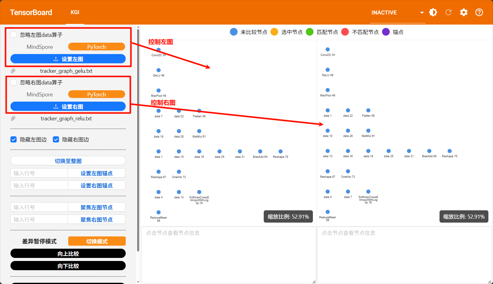

### 2.2.4 算子图上的操作
1. 鼠标滚轮缩放图的大小。
2. 鼠标点击空白处拖动，拖动图。
3. 鼠标点击节点拖动，拖动节点。
4. 点击节点，选中单个节点。
5. 点击边，选中单个边。
6. ctrl+鼠标点击节点，选择多个节点，已选择的节点再次点击取消选择该节点。
7. ctrl+鼠标点击边，选择多个边，已选择的边再次点击取消选择该边。
8. shift+拖动，框选节点和边。

### 2.2.5 隐藏显示边
为减少渲染负担，默认隐藏边，建议放大到局部图再显示边。
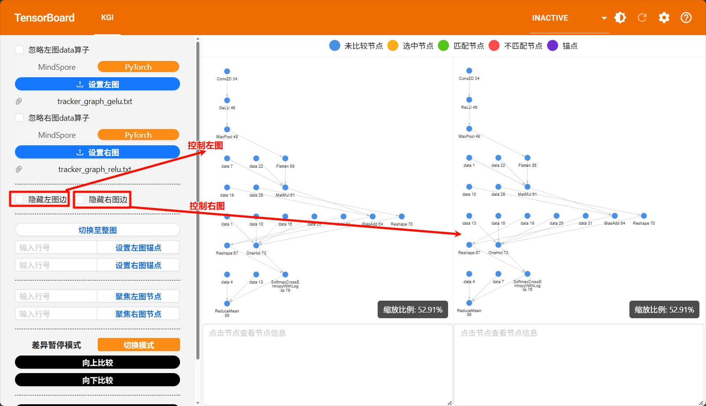

### 2.2.6 设置图范围
`切换至整图`左右图同时显示整图，设置锚点显示锚点及其依赖节点构成的子图。
设置锚点需要填入节点在执行序中的行号，也支持点击中图中节点作为锚点，点击图中节点自动填入选中节点在执行序中的行号。
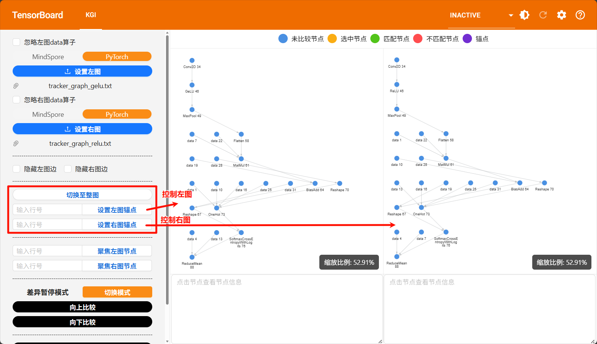

### 2.2.7 聚焦节点
输入节点在执行序中的行号，自动聚焦到图中该节点的位置。
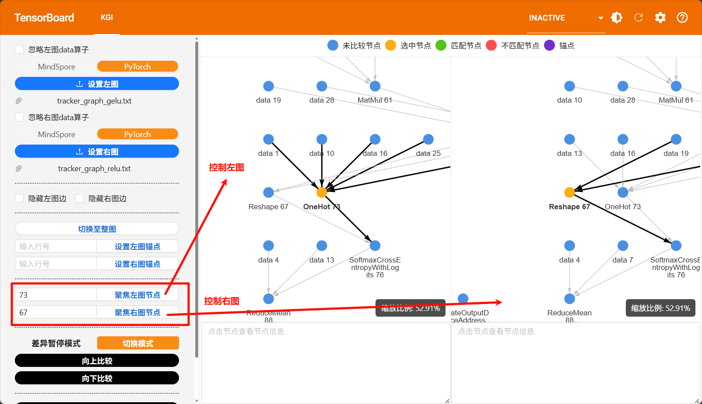

### 2.2.8 比较差异
#### 2.2.8.1 差异暂停模式
支持向下或向上比较，找到差异层就暂停比较，不再比较后续层。
被识别为差异的原因为：该节点特征（算子类型、输入输出参数的dtype、shape、stride和offset）及其前驱（向上比较）/后继（向下比较）节点特征都相同的节点在该层左右图中数量不一致。
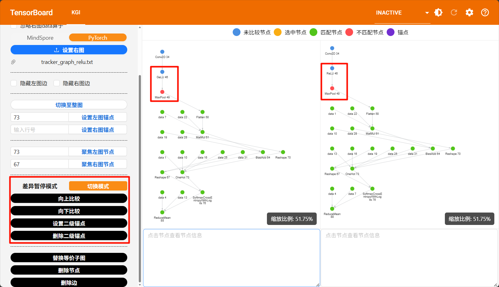
比较后若认为某些节点是匹配的，可设置为二级锚点，基于二级锚点进行比较，二级锚点可设置多个。

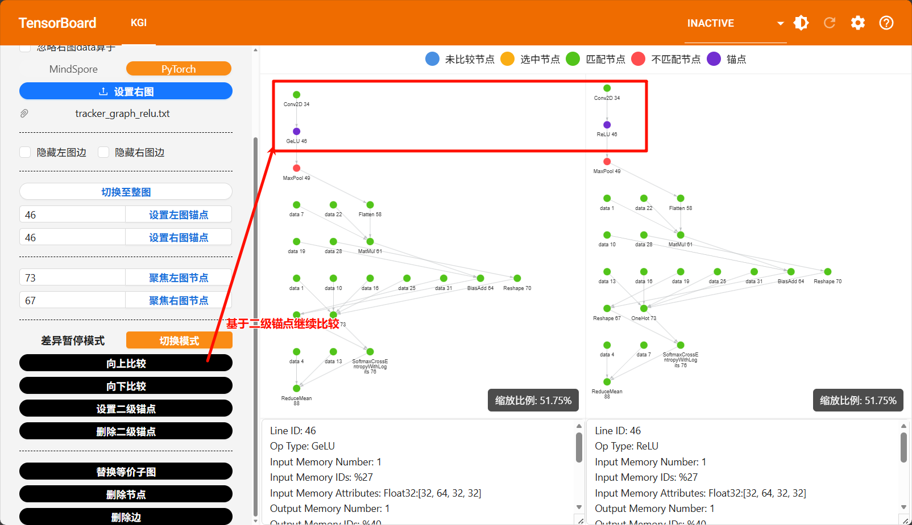
也可删除二级锚点。
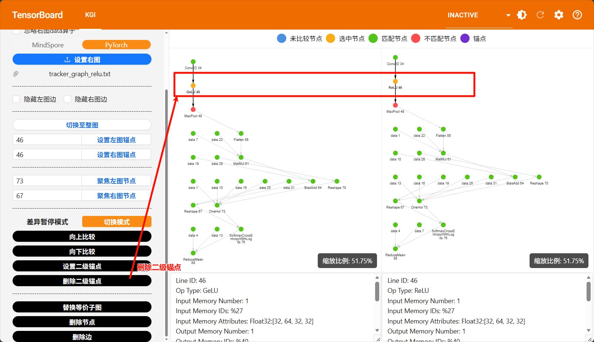

#### 2.2.8.2 比较所有模式
点击切换模式可以在差异暂停模式与比较所有模式间切换。
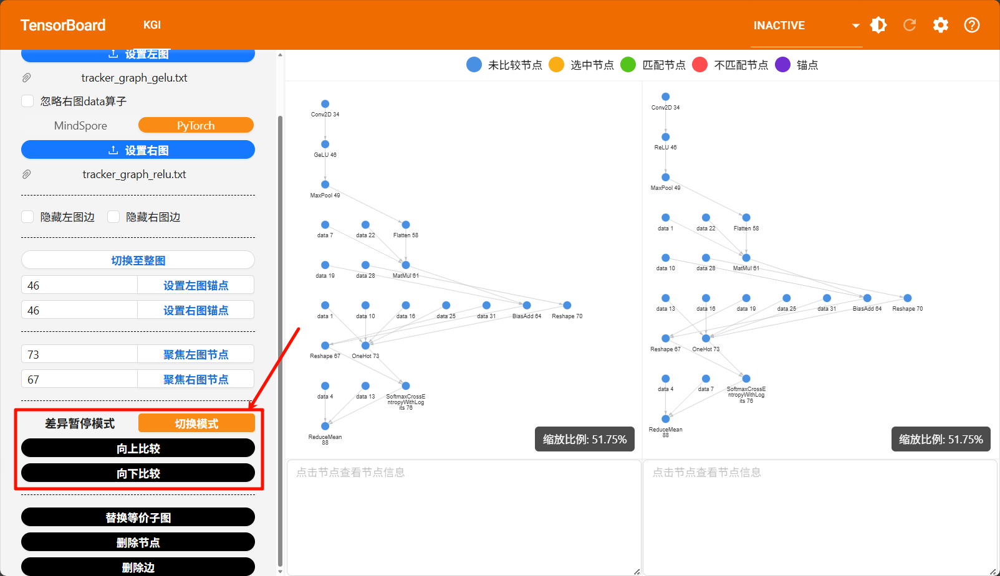
比较所有模式下，支持向上或向下比较，比较所有层的差异，目的是圈出差异区域。
被识别为差异的原因为：
1. 该节点所有前驱（向下比较）/后继（向上比较）都是差异点。
2. 该节点特征（算子类型、输入输出参数的dtype、shape、stride和offset）及其前驱（向上比较）/后继（向下比较）节点特征都相同的节点在该层左右图中数量不一致。
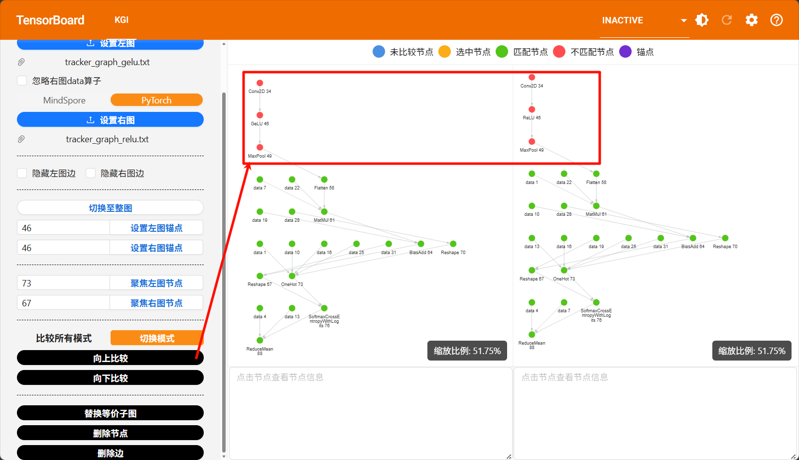

### 2.2.9 替换等价子图
若某些差异判断是等价的，可以将这部分子图替换为等价节点，继续查找其它差异。
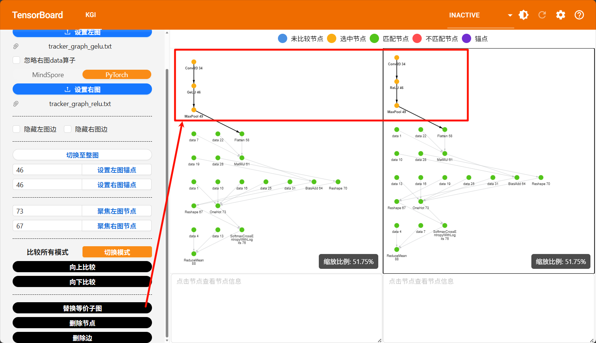
替换结果
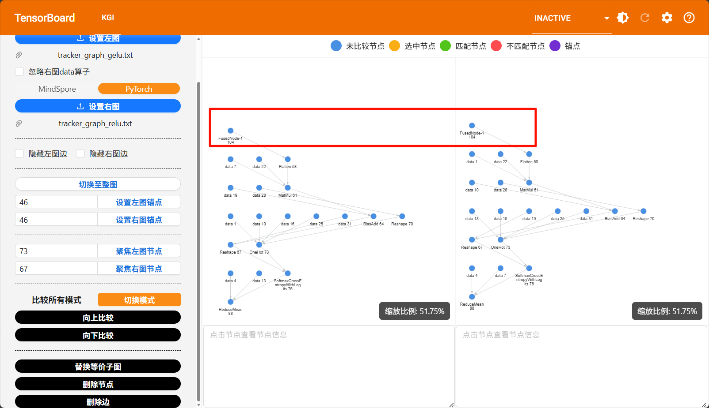

### 2.2.10 删除节点
若某些节点认为是多余的，可以删除这些节点。
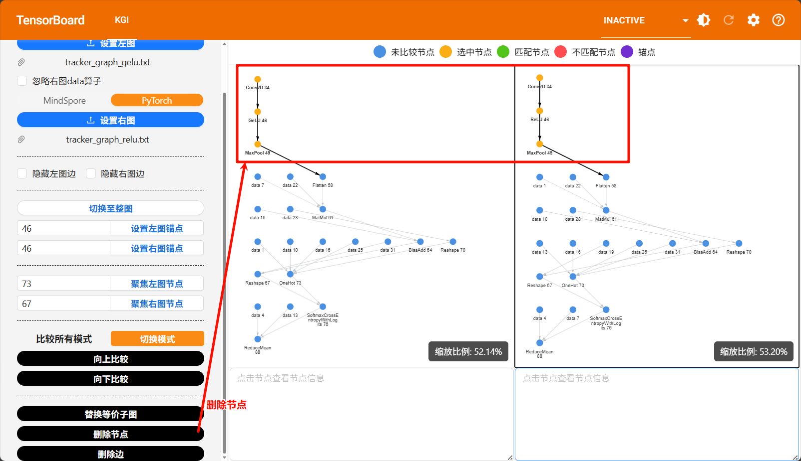

### 2.2.11 删除边
若某些边认为是多余的，可以删除这些边。
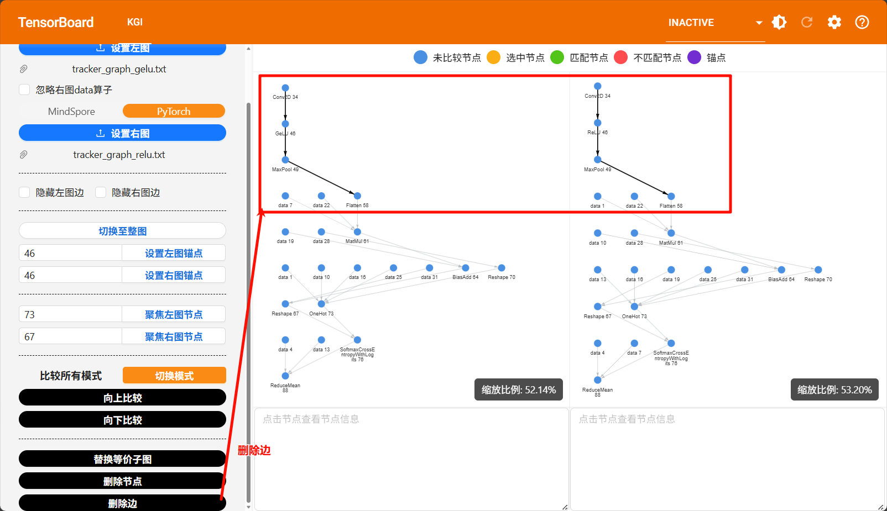

### 2.2.12 查看节点信息
点击图中节点，显示节点信息，点击图中空白处，清除节点信息显示。
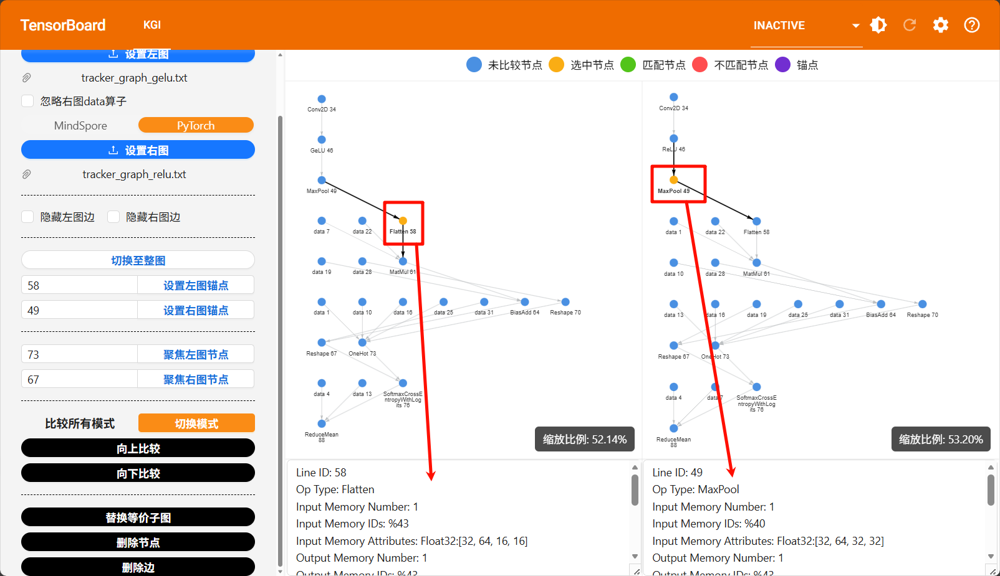

# 三、常见问题处理
## 3.1 PyTorch执行序解析失败，后端报异常
```
ValueError: Operator type {operator type} is not supported
```
{operator type}表示算子类型，该报错原因为{operator type}算子输入输出无法区分，需要到昇腾官网查询{operator type}算子输入输出参数，补充到`backend\kgi\sal\parser\aclnns.json`中，再以源码方式安装插件。

# 四、测试

## 安装可选安装包
```
pip install '.[dev]'
```

## 运行测试
```
pytest
```

# 五、调试及打包

## 调试

### 启动前端
`frontend`目录下运行
```
npm install
npm run dev
```

### 启动后端
项目根目录下运行
```
conda create -n kgi python=3.11
conda activate kgi
pip install -e .
tensorboard --logdir ./
```

### 修改前后端交互端口号
默认使用6006端口
修改后端启动tensorboard命令
```
tensorboard --logdir ./ --port=端口号
```
修改前端`vite.config.ts`文件中
```
server.proxy.target
```

## 打包

### 打包前端
`frontend`目录下运行
```
npm install
npm run build
```

### 打包whl包
项目根目录下运行
```
conda create -n kgi python=3.11
conda activate kgi
python -m build
```

# 六、附录

## 6.1 安全加固建议

### 6.1.1 免责声明

本工具为基于 TensorBoard 底座开发的插件，使用本插件需要基于 TensorBoard 运行，请自行关注 TensorBoard 相关安全配置和安全风险。

### 6.1.2 TensorBoard 版本说明

为 TensorBoard 本身安全风险考虑，建议使用最新版本 TensorBoard 。

### 6.1.3 远程查看数据

如果网络浏览器与启动 TensorBoard 的机器不在同一台机器上， TensorBoard 提供了远程查看数据的指令启动方式，但此种方式会将服务器对应端口在局域网内公开（全零监听），请用户自行关注安全风险。

- 在启动指令尾部加上`--bind_all`或`--host={服务器IP}`参数启用远程查看方式

**(1) 可直连的服务器**

```
tensorboard --logdir ./ --bind_all --port [可选，端口号]
```

默认为 6006 端口，以下示例以 --port 6008 为例

启动后会打印日志:

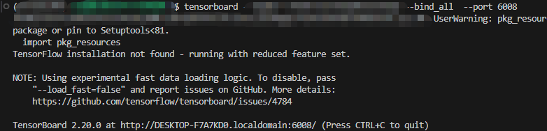

DESKTOP-F7A7KD0.localdomain 是机器地址，6008 是端口号。

**DESKTOP-F7A7KD0.localdomain 需要替换为真实的服务器地址，例如真实的服务器地址为 10.123.456.78，则需要在浏览器窗口输入http://10.123.456.78:6008**

**(2) 不可直连的服务器**

**如果链接打不开，可以尝试以下方法，选择其一即可：**

1.本地电脑网络手动设置代理，例如 Windows10 系统，在【手动设置代理】中添加服务器地址（例如 10.123.456.78）


然后，在服务器中输入：

```
tensorboard --logdir ./ --bind_all --port 6008[可选，端口号]
```

最后，在浏览器窗口输入http://10.123.456.78:6008

**注意，如果当前服务器开启了防火墙，则此方法无效，需要关闭防火墙，或者尝试后续方法**

2.或者使用 vscode 连接服务器，在 vscode 终端输入：

```
tensorboard --logdir ./
```

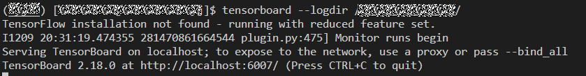

按住 CTRL 点击链接即可

3.或者在本地电脑中安装 tb_graph_ascend 插件

电脑终端输入：

```
tensorboard --logdir ./
```

按住 CTRL 点击链接即可

## 6.2 通信矩阵

| 序号 | 代码仓 | 功能 | 源设备 | 源 IP | 源端口 | 目的设备 | 目的 IP | 目的端口<br/>（监听） | 协议 | 端口说明 | 端口配置 | 监听端口是否可更改 | 所属平面 | 版本 | 特殊场景 | 备注 |
| :--- | :------------------ | :------------------------- | :------------------------------ | :--------------------------------- | :----- | :----------------------- | :------------------------------ | :-------------------- | :--- | :------------------- | :------- | :----------------- | :------- | :------- | :------- | :--- |
| 1 | tensorboard-plugins | TensorBoard 底座前后端通信 | 访问 TensorBoard 浏览器所在机器 | 访问 TensorBoard 浏览器所在机器 ip | | TensorBoard 服务所在机器 | TensorBoard 服务所在服务器的 ip | 6006 | HTTP | TensorBoard 服务通信 | `--port` | 可修改 | 业务面 | 所有版本 | 无 | |
| 2 | tensorboard-plugins | TensorBoard 底座可能存在向公网地址（如CDN）等请求静态资源文件css、woff2等情况 | 访问TensorBoard浏览器所在设备 | 访问TensorBoard浏览器所在设备IP | 随机端口 | 静态资源文件站点（如https://fonts.googleapis.com、https://fonts.gstatic.com）| 目标静态资源文件站点IP | 443 | HTTPS | 通过HTTPS协议请求静态资源时默认的443端口 | 不涉及监听 | 业务面 | 所有版本 | 无 | |
